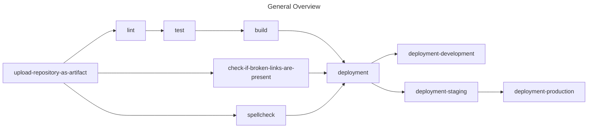

<!-- fuzzy-octo-fortnight ознакомление с предложениями по улучшению языка программирования Swift.
	Copyright (C) 2024-present Vladimir Leonidovich

	This program is free software: you can redistribute
	it and/or modify it under the terms of the GNU General Public License as published by
	the Free Software Foundation, either version 3 of the License, or
	(at your option) any later version.

	This program is distributed in the hope that it will be useful,
	but WITHOUT ANY WARRANTY; without even the implied warranty of
	MERCHANTABILITY or FITNESS FOR A PARTICULAR PURPOSE. See the
	GNU General Public License for more details.

	You should have received a copy of the GNU General Public License
	along with this program. If not, see <https://www.gnu.org/licenses/>.
-->

<!-- [ ](governance): CC-BY -->

<!-- [Vladimir Leonidovich](https://github.com/VladimirCreator/) decided to create [the repository](https://github.com/VladimirCreator/fuzzy-octo-fortnight/) at 5:15 AM on April 12th 2024.
-->

# fuzzy-octo-fortnight

[![GitHub Pages][ci-shield]][ci-url]
![License][license-shield]
[![Love Angular badge][love-angular-shield]][love-angular-url]
[![Conventional Commits][conventional-commits-shield]][conventional-commits-url]
[![semantic-release: angular][semantic-release-shield]][semantic-release-url]
[![code style: prettier][code-style-prettier-shield]][code-style-prettier-url]
[Karma](vscode:extension/sreetamd.karma)

## Table of Contents


- [Description](#description)
- [Sponsor](#sponsor)
- [Essentials](#essentials)
- [Discussion](#discussion)
- [License](#license)
- [Acknowledgments](#acknowledgments)
- [References](#references)

## Description
Ознакомление с предложениями по улучшению языка программирования Swift.

### Keywords


git
conventional-commits semantic-release
gplv3
bash amber
typescript
npm[^1]
nx
jasmine jest karma
eslint prettier
express
rxjs
angular
zod
taiga-ui
ssr[^2] ssg[^3]
ci[^4] cd[^5]
github-pages
toml json yaml
conventional-changelog
storybook
compodoc

## Sponsor
[`https://boosty.to/vladimircreator/donate/`](https://boosty.to/vladimircreator/donate/).

## Essentials

### Getting Started

```bash
$ cd ~ && git clone https://github.com/VladimirCreator/fuzzy-octo-fortnight.git
$ cd fuzzy-octo-fortnight
```

## Discussion


### GitHub Pages
You can visit [the following website](https://vladimircreator.github.io/fuzzy-octo-fortnight/), которая предоставляет доступ к артефакту, документацию, информацию о покрытии тестами и Storybook.

### Lint, Test, Build, Repeat
Процесс сборки провоцирует запуск процесса линтинга, запуск тестов и непосредственно сам процесс сборки, который приводит к появлению артефакта.

The artifact is used для просмотра предложений по улучшению языка программирования Swift.

### Continuous Integration/Continuous Delivery
Диаграмма 1 может дать представление о том, каким образом выглядит весь процесс непрерывной интеграции и непрерывного развёртывания:



#### References
1. [ci-fuzzy-octo-fortnight.yaml](.github/workflows/ci-fuzzy-octo-fortnight.yaml)
2. [github-pages.yaml](.github/workflows/github-pages.yaml)

## License
[This repository](.) is licensed under the terms of the [GPL-3.0](LICENSE) license.

## Acknowledgments


- [repo:simple-icons/simple-icons](https://github.com/simple-icons/simple-icons/)

## References


1. [Angular > Best Practices > Style Guide](https://angular.dev/style-guide/)
2. [Angular > In-depth Guides > Testing](https://angular.dev/guide/testing/)
3. [Angular > In-depth Guides > Testing > Testing Services](https://angular.dev/guide/testing/services#testing-http-services)
4. [Angular > In-depth Guides > Internalization](https://angular.dev/guide/i18n/)
5. [GitHub REST API](https://docs.github.com/en/rest?apiVersion=2022-11-28)

---

<p align="right">Copyright © 2024-present Vladimir Leonidovich. All rights reserved.</p>

[^1]: node-package-manager
[^2]: server-side-rendering
[^3]: static-site-generator
[^4]: continuous integration
[^5]: continuous delivery

[ci-shield]: https://github.com/vladimircreator/fuzzy-octo-fortnight/actions/workflows/ci-fuzzy-octo-fortnight.yaml/badge.svg
[ci-url]: https://github.com/vladimircreator/fuzzy-octo-fortnight/actions/workflows/fuzzy-octo-fortnight.yaml

[conventional-commits-shield]: https://img.shields.io/badge/Conventional%20Commits-1.0.0-%23FE5196?logo=conventionalcommits&logoColor=white
[conventional-commits-url]: https://conventionalcommits.org/

[semantic-release-shield]: https://img.shields.io/badge/semantic--release-angular-e10079?logo=semantic-release
[semantic-release-url]: https://github.com/semantic-release/semantic-release

[license-shield]: https://img.shields.io/github/license/vladimircreator/fuzzy-octo-fortnight?link=https%3A%2F%2Fgithub.com%2Fvladimircreator%2Ffuzzy-octo-fortnight

[love-angular-shield]: https://img.shields.io/badge/angular-love-blue?logo=angular&angular=love
[love-angular-url]: https://www.github.com/angular/angular

[code-style-prettier-shield]: https://img.shields.io/badge/code_style-prettier-ff69b4.svg?style=flat-square
[code-style-prettier-url]: https://github.com/prettier/prettier/
